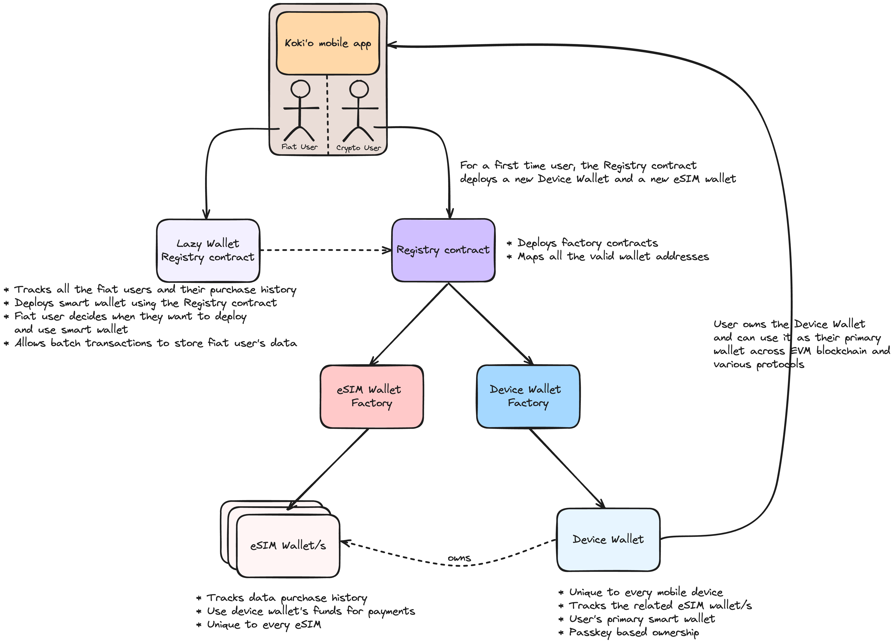

# eSIM Wallet Smart Contract Suite

The **eSIM Wallet Smart Contract Suite** is a comprehensive group of smart contracts designed to deploy, manage, and maintain eSIM-related data and functionalities on the blockchain. Through these contracts, users can subscribe to data bundles and utilize their smart wallets as primary hot wallets. This suite consists of multiple interconnected contracts that ensure seamless user experience:

### Key Components:

- **Registry Contract**:  
  This contract deploys both the Device Wallet Factory and the eSIM Wallet Factory. It serves as a central registry, tracking all Device and eSIM Wallets, ensuring their validity. Any wallets deployed outside this suite are considered invalid. Users can interact with the Registry Contract to deploy their first Device and eSIM Wallets. Additionally, it coordinates with the Lazy Wallet Registry to allow deferred smart wallet deployment.

- **Lazy Wallet Registry**:  
  To optimize gas usage, the Lazy Wallet Registry batches and stores transactions for users who operate with fiat. Smart wallets are deployed only when users choose to interact with them, preloaded with transaction history, ensuring minimal gas expenditure.

- **Device Wallet Factory**:  
  This contract is responsible for deploying individual Device Wallet smart contracts and managing device-specific wallet data.

- **Device Wallet Smart Contract**:  
  Each mobile device is assigned a unique Device Wallet. The app generates P256 keys using passkeys to verify ownership. These wallets allow users to store ETH and ERC-20 tokens, offering full control over their assets and enabling data bundle purchases for their associated eSIMs.

- **eSIM Wallet Factory**:  
  Responsible for deploying all valid eSIM Wallet contracts. Only wallets deployed through this factory are considered legitimate.

- **eSIM Wallet Smart Contract**:  
  Every eSIM is linked to a unique eSIM Wallet, providing an on-chain representation of the eSIM. Users can purchase data bundles through these wallets. For instance, if a user has three eSIMs, three corresponding eSIM Wallets will be deployed, each linked to a unique eSIM. The eSIM Wallets can pull ETH from the Device Wallet, offering a streamlined experience without requiring individual top-ups. Users retain full control over their eSIM Wallets and can revoke or update permissions for each one.

For seamless synchronization, a backend server securely generates unique identifiers for the device and eSIMs. These identifiers are stored in the respective wallets, ensuring secure eSIM generation and accurate data bundle application.

- **P256 Verifier**:  
  A proxy contract that verifies WebAuthn signatures for passkeys using the WebAuthn library. This will serve as an internal P256 verifier for the Kokio app.

- **WebAuthn Library**:  
  A library built on Daimo’s work to verify WebAuthn Authentication Assertions. It attempts to use the RIP-7212 precompile for signature verification, with fallback to FreshCryptoLib if the precompile fails.

## Smart Contract Suite Specifications:

- [Registry Contract](./docs/Registry.md)
- [Registry Helper](./docs/RegistryHelper.md)
- [Lazy Wallet Registry](./docs/LazyWalletRegistry.md)
- [Device Wallet Factory](./docs/device-wallet/DeviceWalletFactory.md)
- [Device Wallet](./docs/device-wallet/DeviceWallet.md)
- [eSIM Wallet Factory](./docs/esim-wallet/ESIMWalletFactory.md)
- [eSIM Wallet](./docs/esim-wallet/ESIMWallet.md)
- [eSIM Wallet Interface](./docs/interfaces/IOwnableESIMWallet.md)
- [P256 Verifier](./docs/P256Verifier.md)
- [Web Authentication Contract](./docs/WebAuthn.md)

## User Flow:

1. **Install the eSIM Wallet App**:  
   Users install the app and register their passkeys. Passkeys (P256 keys) derive their security from the device’s Secure Enclave.
   
2. **Device and eSIM Wallet Deployment**:  
   For new devices, the app requests the Registry to deploy a Device Wallet and an associated eSIM Wallet. These are linked upon deployment.
   
3. **Data Bundle Selection & Purchase**:  
   a. Users select a data bundle plan before eSIM generation.  
   b. The app initiates the purchase. If paid via crypto, both wallets are deployed immediately. For fiat transactions, users can deploy their wallets later if needed.  
   c. Upon successful purchase, the server initiates the eSIM and data bundle provisioning.  
   d. The server generates a unique eSIM identifier and updates the corresponding eSIM Wallet via the Device Wallet.

4. **eSIM Activation**:  
   The app provides a QR code for eSIM activation, which users can scan to begin using the eSIM.

5. **Primary Wallet Use**:  
   Users can also use the Device Wallet as their primary wallet and withdraw funds anytime.

## Future Prospects:

- **Asset Recovery**:  
   Currently, users own their Device and eSIM Wallets and can transfer ownership to another Ethereum address. In the future, recovery rights may be assigned to a secondary keystore, allowing users to recover wallets in case of device loss.

- **Unique Device bound identity**:  
   Currently, the device unique identifier is generated using some device parameters, but it would be great if we could bound an identifier with the secure enclave (TEE) of the mobile devie and associate it with the smart wallet, thus making it a device bound smart wallet.
