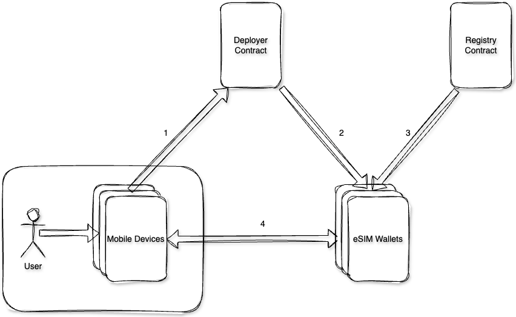

# eSim Wallet Smart Contract Suite

  

  

The eSIM Wallet smart contract suite consists of a group of smart contracts which work together to deploy, record and maintain eSIM related data and functionalities.

  

eSIM wallets are the smart contracts which uniquely identify the primary eSIM of a mobile device. A mobile device can have multiple eSIMs and it is up to the user to set one of them as the primary eSIM, which will be set to eSIM slot 0 by default.

eSIM wallet smart contracts will uniquely identify the eSIM and in future, will be capable of buying data bundles from the carrier providers for the eSIM.

  

The deployer contract is responsible for deploying eSIM wallets for all the primary eSIMs. The LPA instructs the deployer contract to deploy an eSIM wallet smart contract if it does not already exist.

  

Registry contract keeps note of all the eSIM wallets deployed along with their unique identifier. It also stores the ECDSA owner of the smart wallet.

  

## Smart Contract Suite User Flow:

1.  User installs LPA
    
2.  LPA instructs the deployer contract to deploy an eSIM wallet
    
3.  Registry contract takes note of the newly deployed eSIM wallet
    
4.  LPA now directly interacts with the eSIM wallet to carry out operations
    

  

## Asset recovery procedure:

The LPA upon installation will create a keystore (referred as primary keystore) which will be located on the user's mobile device.

When the eSIM wallet is deployed, the user is asked to register a secondary keystore (which can be created from the LPA, or provided by the user). This secondary keystore will be registered on the user's eSIM wallet and it will hold withdrawal rights.

In case the user loses his mobile device or the primary keystore, they will be able to withdraw any asset stored in the eSIM wallet via the secondary keystore.

  

## Future prospects:

A mobile device can have multiple eSIMs and eSIMs can easily be destructed, hence to avoid multiple smart contract deployments and transactions, the smart contract suite will only deploy smart contracts for the primary eSIMs as chosen by the user.

In future, a primary eSIM wallet will act as a parent smart contract which will have multiple child contracts (or secondary eSIM wallets) meaning that each eSIM will have its own eSIM wallet smart contract.

The secondary smart wallets can be destroyed depending on the respective eSIM’s validity.

After onboarding the carrier providers onto the blockchain space, it will be possible to create a marketplace for data bundles and the users will be able to buy data packs using the eSIM wallets.
