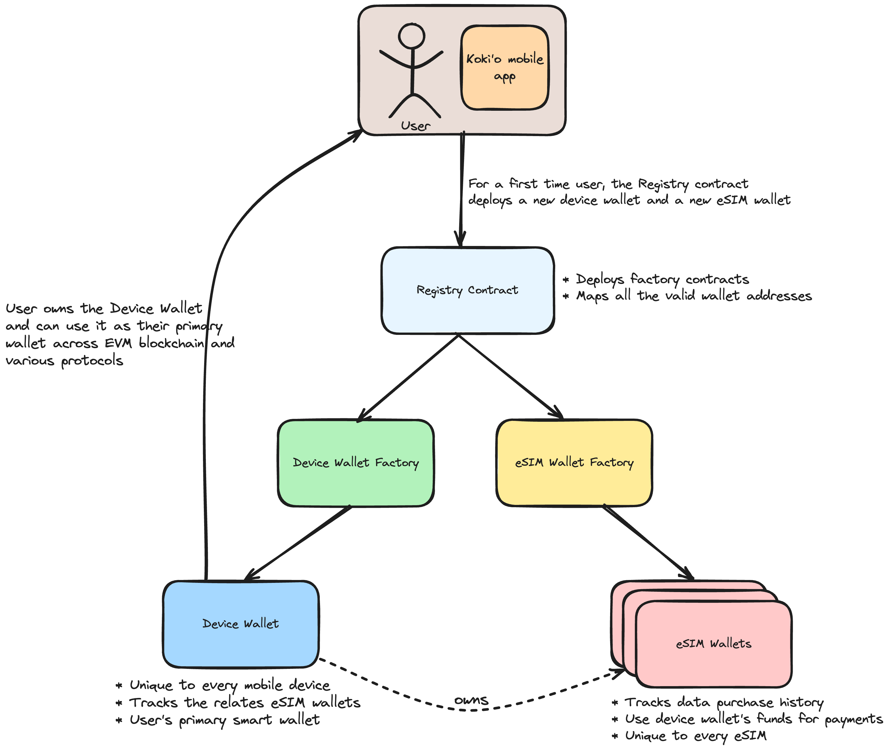

# eSim Wallet Smart Contract Suite

The eSIM Wallet smart contract suite consists of a group of smart contracts which work together to deploy, record and maintain eSIM related data and functionalities. Using the smart contracts, the user can pay for their data bundle subscriptions and can also use the smart wallet as their primary hot wallet. There are multiple smart contracts that make this possible:  

* **Registry Contract** - Responsible for deploying both the factory contracts (Device Wallet Factory and ESIM Wallet Factory). It also acts as a registry for keeping note of all the Device Wallets and ESIM Wallets deployed and marks them as valid. Any Device Wallet or ESIM Wallet deployed outside the contract suite might be unknown to the Registry and will be considered invalid. Users can interact with the Registry contract to deploy their first Device and ESIM wallet.  

* **Device Wallet Factory** - Responsible for deploying device wallet smart contracts and maintaining device wallet related data.  

* **Device Wallet Smart Contract** - Every user (ETH address of the master keystore created by the eSIM wallet app) has a unique device wallet per mobile device.  
Users can use the device wallet as their personal smart contract wallet to store ETH and other ERC-20 tokens and have full ownership of the wallet.    

* **eSIM Wallet Factory** - Responsible for deploying all the eSIM wallet smart contracts. Only the eSIM smart contracts deployed by this factory will be valid smart contracts.  

* **eSIM Wallet Smart Contract** - Each eSIM is associated with a unique eSIM wallet smart contract. This eSIM wallet is an on-chain representation of the eSIM and allows user to buy the data bundles.  

For example, if a user has 3 eSIMs in his mobile device, then there will be 3 eSIM wallets associated with a device wallet. Each of these eSIM wallets are mapped to their respective eSIM. Moreover all of these eSIMs have the ability to pull ETH from their respective device wallet, allowing user for a smooth experience and not worrying about topping-up each of the eSIM wallet. The user also owns all these eSIM wallets and hence can update/revoke any eSIM wallet's ability to pull ETH from the device wallet.

For the eSIM wallet and device wallet to perfectly map to a user's mobile device and eSIMs, a server in the backend securely generates unique identifiers. The device wallet and the eSIM wallets deployed by the master keystore (through the eSIM wallet app) store these unique identifiers, thus allowing the server to proceed with generating eSIM (in case of buying a new eSIM) or applying data bundle for the correct eSIM.

## Contract Specs:

* [Registry Contract](./docs/Registry.md)

* [Registry Helper](./docs/RegistryHelper.md)

* [Lazy Wallet Registry](./docs/LazyWalletRegistry.md)

* [Device Wallet Factory](./docs/device-wallet/DeviceWalletFactory.md)  

* [Device Wallet](./docs/device-wallet/DeviceWallet.md)  

* [eSIM Wallet Factory](./docs/esim-wallet/ESIMWalletFactory.md)  

* [eSIM Wallet](./docs/esim-wallet/ESIMWallet.md)

* [eSIM Wallet Interface](./docs/interfaces/IOwnableESIMWallet.md)

* [P256Verifier](./docs/P256Verifier.md)

* [Web Authentication contract](./docs/WebAuthn.md)

## Smart Contract Suite User Flow:

1. User installs eSIM wallet app  

2. The eSIM wallet app generates a master keystore for the device. The master keystore derives its security from the device's Secure Enclave  
    
3. For a new device, the eSIM wallet app requests the Registry contract to deploy a new device wallet and a new eSIM wallet. The eSIM wallet is associated with the device wallet upon deployment.  
    
4. a. Once the smart contract wallets are deployed, the user can go ahead and select a data bundle plan to apply to the new eSIM (eSIM is not yet generated. For a new eSIM, it is a pre-requisite to purchase a data bundle).  
b. Once the data bundle plan is selected, the eSIM wallet app initiates a purchase on the respsective eSIM wallet.  
c. Upon successul transaction, the backend server initiates a request for a new eSIM and the data bundle.  
d. The server securely generates a unique eSIM identifier based on the eSIM and updates the eSIM wallet with this identifier (using the Device Wallet).  

5. The eSIM wallet app provides user with the eSIM QR code, which the user can scan to activate and use the eSIM.  

6. The user can also use the Device Wallet as their primary wallet and withdraw funds anytime.  

## Future prospects: 

* **Asset recovery**: As of now, the user owns all their smart wallets (device wallet and eSIM wallets) and can change the ownership to their other ETH address. In future, a secondary keystore will be assigned recovery related admin rights, where if the user looses their mobile device, they can transfer the ownership of the wallets to their other address.  
