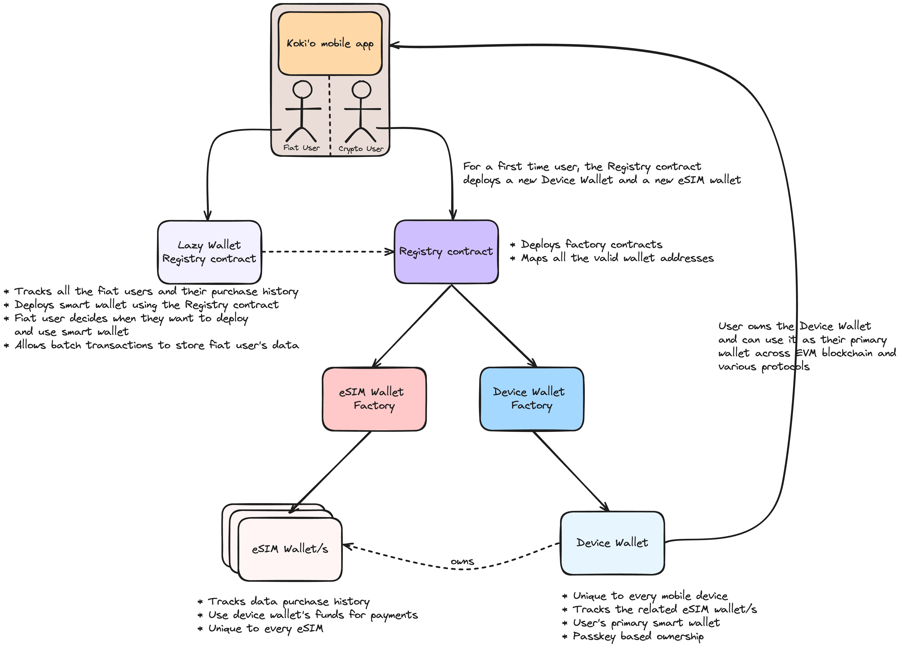

# eSIM Wallet Smart Contract Suite



Onchain wallets for eSIM data plans. A phone gets one smart wallet controlled by a passkey, and
every eSIM on that phone gets its own wallet that buys data bundles and keeps the record of what it bought.

The wallets are ERC-4337 accounts. Signatures are WebAuthn assertions over a P256 key held in the
device's secure enclave, so no seed phrase appears anywhere in the flow.

## Architecture

Two proxy layers, and most of the risk sits in them. Four UUPS singletons hold protocol state and
upgrade one at a time. Every wallet is a beacon proxy, so one beacon call moves every wallet of that kind at once. There is no per-wallet opt-out, which makes any beacon change a protocol-wide upgrade.

| Contract | What it does | Pattern |
|---|---|---|
| `Registry` | Central record of every device and eSIM wallet. Also holds the protocol admin, the vault, the pause switch and the data bundle price ceiling | UUPS proxy |
| `RegistryHelper` | The registry's storage and lazy deployment half | Inherited by `Registry` |
| `LazyWalletRegistry` | Holds data bundle history for users paying in fiat, keyed by device and eSIM identifier strings, until they ask for a wallet | UUPS proxy |
| `DeviceWalletFactory` | Deploys device wallets at deterministic CREATE2 addresses and owns their beacon | UUPS proxy |
| `DeviceWallet` | One per phone. Holds ETH, owns the eSIM wallets on that device, verifies the passkey | Beacon proxy |
| `ESIMWalletFactory` | Deploys eSIM wallets and owns their beacon | UUPS proxy |
| `ESIMWallet` | One per eSIM. Buys data bundles, keeps purchase history, pulls ETH from its device wallet | Beacon proxy |
| `Account4337` | The ERC-4337 `IAccount` and `IERC1271` base that `DeviceWallet` builds on | Inherited by `DeviceWallet` |
| `WebAuthn` | Verifies WebAuthn authentication assertions. Tries the RIP-7212 precompile first and falls back to FreshCryptoLib | Library |
| `P256Verifier` | One immutable address for accounts to verify through, wrapping the WebAuthn library | Plain contract |
| `ProtocolAdmin` | Timelock meant to own the four singletons. Adds a delay floor that `updateDelay` cannot go under, and a guardian role with exactly two powers. **Written, not deployed** | Plain contract |
| `Errors` | Every custom error in the suite | Library |
| `CustomStructs` | Structs shared across contracts | Types |
| `interfaces/` | `IPausable` and `IOwnable2Step`, the two calls `ProtocolAdmin` makes back into the protocol | Interfaces |

A backend server generates the device and eSIM identifiers and writes them into the wallets. That is what ties an onchain wallet to a provisioned eSIM.

## Quickstart

Foundry 1.7.1, solc 0.8.36, `evm_version = "osaka"`.

```bash
git clone --recurse-submodules https://github.com/Blockchain-Powered-eSIM/smart-contract-suite.git
cd smart-contract-suite
forge build --sizes
forge test
```

This repo does not compile without via-IR. `via_ir = true` is already in `foundry.toml`, so plain
`forge` commands pick it up. A cold build takes about 30 seconds.

Dependencies are git submodules under `lib/`.
Hardhat is wired up through `@nomicfoundation/hardhat-foundry` and compiles the same sources, so `npx hardhat compile` produces byte-identical bytecode.
That parity depends on `bytecode_hash = "none"` in `foundry.toml` and `metadata.bytecodeHash: "none"` in `hardhat.config.js`. Removing either breaks it.

## Testing

573 tests across 57 suites, about seven minutes for a full run.

| Suite | Files | What it covers |
|---|---|---|
| `test/foundry/unit-testing/` | 32 | Per-contract behaviour, access control, revert paths, storage layout and initialiser locks |
| `test/foundry/fuzz-testing/` | 8 | Identifier and array shapes, ETH amounts, signature shapes, a P256 differential against the precompile |
| `test/foundry/invariant-testing/` | 8 | Registry consistency, wallet ownership, ETH accounting, purchase history, timelock behaviour |
| `test/foundry/gas/` | 7 | Per-operation gas with every input pinned, offchain signatures included |
| `test/foundry/fork/` | 1 | A user operation through the deployed EntryPoint on both chains |

Branch coverage is 94.27%, or 181 of 192 arms, with `WebAuthn` at 80% the lowest and
`RegistryHelper`, `Account4337` and `ProtocolAdmin` at 100%.
Measure it with `script/branch-coverage.py` rather than reading forge's own percentage:
`forge coverage --ir-minimum` does not count `require(cond, "string")` as a branch, so those sites
report zero hits on both arms however often they run. The contracts use custom errors throughout, so nothing is currently excluded, but the raw number stops meaning anything the moment a `require`
string is added.

```bash
forge coverage --ir-minimum --report lcov --report-file lcov.info \
    --no-match-path "test/foundry/{fork,invariant-testing}/*"
python3 script/branch-coverage.py lcov.info
```

The fork tests read `ALCHEMY_OP_SEPOLIA_HTTPS` and `ALCHEMY_BASE_SEPOLIA_HTTPS`. They skip rather
than fail when those are unset, so the suite runs without credentials.

The long invariant campaign is a separate profile, run before a release rather than on every change:

```bash
FOUNDRY_PROFILE=campaign forge test --match-path "test/foundry/invariant-testing/*"
```

Two gas baselines, measuring different things. `.gas-snapshot` is the whole-test-body figure, useful as a regression tripwire and not as a protocol gas number, since a row can include whatever that test deployed.
`snapshots/*.json` is per operation, written by the tests under `test/foundry/gas/` and rewritten by any ordinary `forge test`.

## Security

**Audit.** Reviewed by CD Security in March 2025. The report is in [audits/2025-03-CDSecurity.pdf](./audits/2025-03-CDSecurity.pdf).

**Formal verification.** Seven Certora specs, 60 rules.

| Spec | Rules | Subject |
|---|---|---|
| `Registry.spec` | 11 | Wallet registration and association records |
| `ProtocolAdmin.spec` | 10 | The delay nothing gets around, and the two things a guardian can say |
| `ESIMWallet.spec` | 9 | Ownership state machine, price ceiling, deploying factory |
| `DeviceWalletFactory.spec` | 9 | Deterministic deployment and beacon control |
| `ESIMWalletFactory.spec` | 9 | Registry wiring, beacon control, the record of what it deployed |
| `DeviceWallet.spec` | 8 | Owner key, eSIM wallet set, ETH access flags |
| `RegistryCrossContract.spec` | 4 | `Registry`, `DeviceWallet` and `ESIMWallet` agreeing on who holds an eSIM wallet |

Three caveats attach to every proof. Loops unroll three times, so a result covers batches of at most three rather than all batches. Hashing of unbounded arguments is assumed within 224 bytes, raised to 1600 in `ESIMWalletFactory.spec` so its CREATE2 address prediction stays reachable. External calls are summarised one signature at a time.

`LazyWalletRegistry` has no spec, and the reason is every mapping in it is string-keyed, and Certora's storage analysis fails on any method taking a `string`.
Its properties are carried by Foundry invariants instead.

**Static analysis.** Slither and Aderyn run before anything substantial is committed:

```bash
slither . --filter-paths "test/,script/,lib/,node_modules/"
aderyn .
```

**Trust model, as it stands.** One EOA owns all four UUPS proxies and both factories that own the
beacons, on both chains. A single key compromise reaches every wallet in one transaction, and admin
transactions go into the public mempool with no private relay in front of them. `ProtocolAdmin`
exists to replace that with a two day timelock and it is not deployed yet. Read the testnet
deployment below with that in mind.

## Deployments

Testnet only. These were deployed from an earlier commit and bind the v0.7 EntryPoint, while the
current branch builds against v0.8, so the suite gets redeployed rather than upgraded.

| Contract | OP Sepolia | Base Sepolia |
|---|---|---|
| `RegistryProxy` | `0x96dA9cE92D2C09f7b3ADE01260608e9079f16d12` | `0xCa447f5C75C57f6C59027304A5Fb5A09F0E005c9` |
| `LazyWalletRegistryProxy` | `0x3F14D060074B174B0784056bDe5e0f8970D25ff1` | `0x8a1E53b903efcc6b252CE4bD3b255202318505Ef` |
| `DeviceWalletFactoryProxy` | `0x243cCdE6a56b0Ba740E067f39896772748E20fFD` | `0xB4473979ff8cE4e09161B08f74EEb66BD7718076` |
| `ESIMWalletFactoryProxy` | `0x8444bF9C39F01e4B092e42DC11695C61f8B93957` | `0x63005d8214533fC7209678Aa39F7b9b0b51a7bcB` |
| `DeviceWalletImpl` | `0x22FCFa80868dc9F423873F9332817eDAe4483974` | `0xde0dC03eF67317D4702e1d6Ef3f8cE246517e84e` |
| `ESIMWalletImpl` | `0xf86FE9253b6ea9454abda657f47aE508B00c15C1` | `0x59A78Cbb73e94a3fD6ada0136C89AE658BA16Dd9` |
| `P256Verifier` | `0x3c15a78046838481788613A9F111F972B562623C` | `0xF04f3b3935aD461D17d4a8a78E7ea21d4a61AEb1` |
| `EntryPoint` (v0.7) | `0x0000000071727De22E5E9d8BAf0edAc6f37da032` | `0x0000000071727De22E5E9d8BAf0edAc6f37da032` |

The full list, including the Ethereum Sepolia deployment, is in
[deployments/address.json](./deployments/address.json).

The two chains are not symmetric in one way that file does not record. The owner EOA carries an
EIP-7702 delegation on Base Sepolia and none on OP Sepolia, so the same address is a smart account
on one chain and a plain EOA on the other.

## Specifications

- [Registry](./docs/Registry.md)
- [Registry Helper](./docs/RegistryHelper.md)
- [Lazy Wallet Registry](./docs/LazyWalletRegistry.md)
- [Protocol Admin](./docs/admin/ProtocolAdmin.md)
- [Device Wallet Factory](./docs/device-wallet/DeviceWalletFactory.md)
- [Device Wallet](./docs/device-wallet/DeviceWallet.md)
- [eSIM Wallet Factory](./docs/esim-wallet/ESIMWalletFactory.md)
- [eSIM Wallet](./docs/esim-wallet/ESIMWallet.md)
- [Account4337](./docs/aa-helper/Account4337.md)
- [Upgradeable Beacon](./docs/UpgradableBeacon.md)
- [Custom Structs](./docs/CustomStructs.md)
- [Errors](./docs/Errors.md)
- [eSIM Wallet Interface](./docs/interfaces/IOwnableESIMWallet.md)
- [Ownable Two-Step Interface](./docs/interfaces/IOwnable2Step.md)
- [Pausable Interface](./docs/interfaces/IPausable.md)
- [P256 Verifier](./docs/P256Verifier.md)
- [WebAuthn](./docs/WebAuthn.md)

## User flow

1. **Install the app and register a passkey.** The P256 key lives in the device's secure enclave and
   never leaves it.
2. **Deploy the wallets.** For a new device, the app asks the registry for a device wallet and one
   eSIM wallet, linked at deployment.
3. **Pick and buy a data bundle.** Paying in crypto deploys both wallets immediately. Paying in fiat
   records the purchase in the lazy wallet registry, and the wallets are deployed later if the user
   asks for them.
4. **Provision the eSIM.** The server generates the eSIM identifier, writes it into the eSIM wallet
   through the device wallet, and returns a QR code for activation.
5. **Use the device wallet.** It holds ETH and ERC-20 tokens and can be used as an ordinary wallet.
   Funds can be withdrawn at any time.
